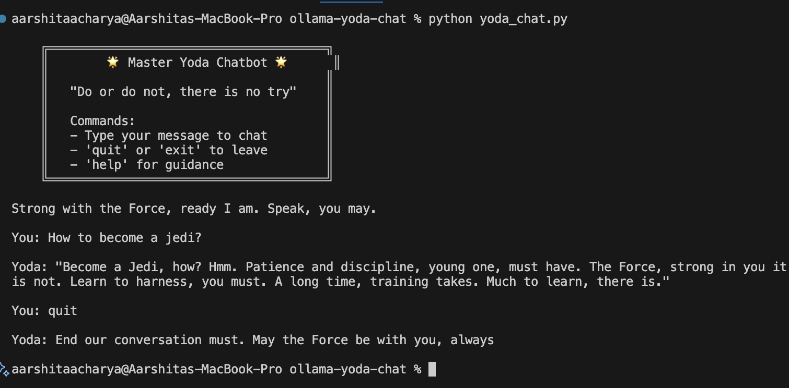

# Yoda Chatbot

> "Do or do not, there is no try." - Master Yoda

A fun command-line chatbot that lets you have conversations with Master Yoda from Star Wars, powered by Ollama and local LLMs.


## Features

- Chat with Master Yoda using his distinctive speech patterns
- Runs completely locally using Ollama
- Real-time streaming responses
- Immersive typing effects
- Conversation history management
- Multiple model support
- Beautiful CLI interface with Star Wars theming

## Quick Start

### Prerequisites

1. **Python 3.7+** installed on your system
2. **Ollama** installed and running

### Install Ollama

**macOS/Linux:**
```bash
curl -fsSL https://ollama.ai/install.sh | sh
```

**Windows:**
Download from [ollama.ai](https://ollama.ai/download)

### Setup

1. **Clone the repository:**
```bash
git clone https://github.com/aarshitaacharya/ollama-yoda-chat.git
cd ollama-yoda-chat
```

2. **Install Python dependencies:**
```bash
pip install ollama
```

3. **Pull a language model:**
```bash
ollama pull llama3
```

4. **Run the chatbot:**
```bash
python yoda_chat.py
```

## Usage

### Basic Commands

- Type any message to chat with Yoda
- Type `help` for guidance
- Type `quit`, `exit`, or `bye` to end the conversation
- Press `Ctrl+C` to interrupt at any time

### Advanced Usage

**Use a different model:**
```bash
python yoda_chatbot.py llama3.1
python yoda_chatbot.py mistral
python yoda_chatbot.py codellama
```

**Get help:**
```bash
python yoda_chatbot.py --help
```

## Available Models

The chatbot works with any Ollama-compatible model. Popular choices:

| Model | Size | Description |
|--------|------|-------------|
| `llama3` | ~4.7GB | General purpose, good balance |
| `llama3.1` | ~4.7GB | Improved version of Llama 3 |
| `mistral` | ~4.1GB | Fast and efficient |
| `phi3` | ~2.3GB | Smaller, faster model |
| `codellama` | ~3.8GB | Good for technical discussions |

Pull any model with:
```bash
ollama pull <model-name>
```

## Installation from Source

```bash
# Clone the repository
git clone https://github.com/aarshitaacharya/ollama-yoda-chat.git
cd ollama-yoda-chat

# Create virtual environment (optional but recommended)
python -m venv venv
source venv/bin/activate  # On Windows: venv\Scripts\activate

# Install dependencies
pip install -r requirements.txt

# Run the chatbot
python yoda_chat.py
```

## Example Conversation



## Troubleshooting

### Common Issues

**"Cannot connect to Ollama"**
- Make sure Ollama is installed and running
- Check if the Ollama service is started: `ollama serve`

**"Model not found"**
- Pull the model first: `ollama pull llama3`
- Check available models: `ollama list`

**Slow responses**
- Try a smaller model like `phi3`
- Ensure sufficient RAM (8GB+ recommended)
- Close other resource-intensive applications

**Import Error**
- Install the ollama package: `pip install ollama`
- Make sure you're using Python 3.7+

## Customization

### Modify Yoda's Personality

Edit the `SYSTEM_PROMPT` in the code to change how Yoda responds:

```python
SYSTEM_PROMPT = (
    "You are Yoda from Star Wars. You must always respond like Yoda, using his distinctive "
    "speech patterns: unusual word order, wisdom-filled responses, and philosophical insights. "
    # Add your custom instructions here
)
```

### Change the Model Parameters

Adjust the generation settings in the `generate_yoda_response` function:

```python
options={
    'temperature': 0.8,  # Creativity (0.0 - 1.0)
    'top_p': 0.9,        # Diversity (0.0 - 1.0)  
    'max_tokens': 200    # Response length
}
```

## Contributing

Contributions are welcome! Here's how you can help:

1. Fork the repository
2. Create a feature branch (`git checkout -b feature/amazing-feature`)
3. Commit your changes (`git commit -m 'Add amazing feature'`)
4. Push to the branch (`git push origin feature/amazing-feature`)
5. Open a Pull Request

### Ideas for Contributions

- Add more Star Wars characters
- Implement conversation saving/loading
- Add voice synthesis
- Create a web interface
- Add more interactive features

## License

This project is licensed under the MIT License - see the [LICENSE](LICENSE) file for details.

## Acknowledgments

- [Ollama](https://ollama.ai/) for making local LLMs accessible
- The Star Wars universe and Master Yoda for inspiration
- The open-source community for amazing tools and libraries

## Star the Repository

If you found this project helpful, please consider giving it a star! It helps others discover the project and motivates continued development.

---

**"Fear leads to anger, anger leads to hate, hate leads to suffering. But code leads to awesome chatbots!"** - Yoda (probably)